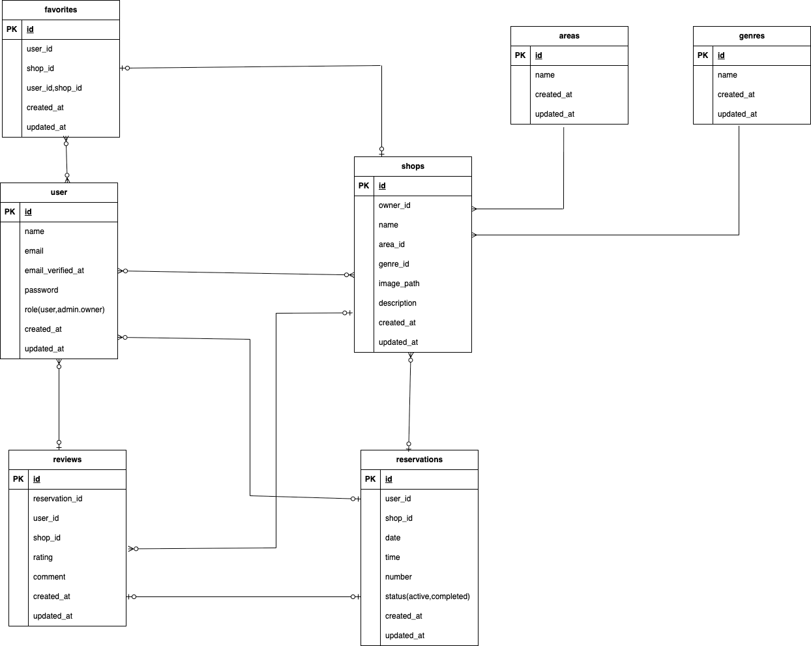

# 飲食店予約アプリ

飲食店の検索・予約・レビュー投稿ができる Web アプリケーションです。  
ユーザーは会員登録・メール認証後にログインし、店舗の検索や予約が可能です。  
管理者やオーナーは店舗や予約情報を管理できます。

---

## 作成した目的
- 学習の課題としての取り組み
  - 飲食店の予約管理を効率化する
  - 店舗ごとにオーナーが予約状況を確認できる仕組みを提供する
  - 管理者が通知やオーナー管理を行えるようにする

---

## アプリケーション URL
- 開発環境（local）: http://localhost  
- ステージング環境（AWS EC2）: http://3.113.30.77  
- MailHog（メール認証確認用）
  - local: http://localhost:8025
  - staging: http://3.113.30.77:8025  

※ 本番環境では AWS SES を利用想定です。

---

## 他のリポジトリ
なし（本リポジトリのみ）

---

## 機能一覧
- 会員登録 / ログイン / ログアウト（メール認証必須）
- 店舗一覧 / 詳細表示
- 店舗検索（エリア / ジャンル / 店名）
- お気に入り登録 / 解除
- 予約登録 / 予約キャンセル / 予約確認（QR コード付き）
- レビュー投稿（星評価・コメント）
- 管理者機能
  - オーナー作成
  - 通知送信（全体 / 常連ユーザー / オーナー）
      - テスト送信後Mailhugにて確認
- オーナー機能
  - オーナーダッシュボード
  - 店舗の作成 / 編集
  - 予約状況確認

---

## 使用技術（実行環境）
- フレームワーク: Laravel 8.83.29(PHP 8.1.33)
- フロントエンド: Blade, CSS
- データベース: MySQL (Amazon RDS)
- 認証: Laravel Fortify, メール認証 (MailHog)
- インフラ: AWS (EC2, RDS, S3)
- Web サーバー: nginx + php-fpm
- その他: Docker (ローカル開発環境)

---

## テーブル設計
- users (会員情報、オーナー/管理者含む)
- shops (店舗情報)
- reservations (予約情報)
- favorites (お気に入り)
- reviews (レビュー)
- areas (エリア)
- genres (ジャンル)
- notifications (通知ログ)

---

## ER 図
データベース設計の概要：



---

## 環境構築

### 開発環境（Docker利用）
#### ビルド＆起動
```
docker compose up -d --build
```

#### Laravelコンテナに入る
```
docker-compose exec php bash
```

#### 依存関係をインストール
```
composer install
```

#### 環境ファイルをコピー
```
cp .env.example .env
```
#### .env設定例
```
DB_CONNECTION=mysql
DB_HOST=mysql
DB_PORT=3306
DB_DATABASE=laravel_db
DB_USERNAME=laravel_user
DB_PASSWORD=laravel_pass
```
#### アプリケーションキーを生成
```
php artisan key:generate
```
#### 画像表示用のシンボリックリンク作成
```
php artisan storage:link
```
#### データベースをマイグレート & シーディング
```
php artisan migrate --seed
```
#### 開発サーバー起動
```
php artisan serve
```
---
### 本番環境構築例（AWS想定）
#### 構成
- EC2:Laravel(nginx+php-fpm)
- RDS:MySQL
- S3:画像ファイル保存
- SES:メール送信（認証メール・通知）
#### デプロイ手順例
1. EC2にSSH接続
```
ssh -i "my-key.pem" ec2-user@xx.xx.xx.xx
```
2. ソースコード配置
```
cd /var/www
git clone https://github.com/xxxx/restaurant-reservation.git
cd restaurant-reservation/src
```
3. PHP 依存関係インストール
```
composer install --optimize-autoloader --no-dev
```
4. 環境変数ファイル設定
```
cp .env.production .env
```
.env.production 例
```
APP_ENV=production
APP_DEBUG=false
APP_URL=https://yourdomain.com

DB_CONNECTION=mysql
DB_HOST=xxxx.rds.amazonaws.com
DB_PORT=3306
DB_DATABASE=laravel_db
DB_USERNAME=laravel_user
DB_PASSWORD=secure_pass

MAIL_MAILER=ses
MAIL_FROM_ADDRESS="noreply@yourdomain.com"
MAIL_FROM_NAME="${APP_NAME}"
AWS_ACCESS_KEY_ID=xxxxxxxx
AWS_SECRET_ACCESS_KEY=xxxxxxxx
AWS_DEFAULT_REGION=ap-northeast-1

FILESYSTEM_DRIVER=s3
AWS_BUCKET=your-s3-bucket
```
5. アプリケーションキー生成
```
php artisan key:generate
```
6. ストレージリンク
```
php artisan storage:link
```
7.  DB マイグレーション & シーディング
```
php artisan migrate --seed --force
```
8. キャッシュクリア & 再生成
```
php artisan config:cache
php artisan route:cache
php artisan view:cache
```
9. nginx / php-fpm 再起動 
```
sudo systemctl restart nginx
sudo systemctl restart php-fpm
```
#### nginx 設定例（参考）
EC2 上で nginx を利用する際の最小構成例です。
/etc/nginx/conf.d/laravel.conf に配置してください。
実際のドメインやパスに応じて修正が必要です。
SSL 対応やセキュリティ強化は別途設定してください。

- nginx
```
server {
    listen 80;
    server_name yourdomain.com;

    root /var/www/restaurant-reservation/src/public;

    index index.php index.html;

    location / {
        try_files $uri $uri/ /index.php?$query_string;
    }

    location ~ \.php$ {
        include fastcgi_params;
        fastcgi_pass   unix:/var/run/php-fpm/www.sock;　# 環境により修正
        fastcgi_param  SCRIPT_FILENAME $document_root$fastcgi_script_name;
        fastcgi_index  index.php;
    }

    location ~ /\.ht {
        deny all;
    }

    client_max_body_size 20M;
}
```
設定反映後は以下を実行します。
```
sudo systemctl restart nginx
sudo systemctl restart php-fpm
```

### 環境ごとの違い

| 項目 | 開発環境（local, Docker） | ステージング環境（AWS EC2） |
|------|--------------------------|-----------------------------|
| 画像保存 | `storage/public` を利用 | Amazon S3 を利用 |
| メール送信 | MailHog を利用（http://localhost:8025） | MailHog を EC2 上に起動（http://<EC2_IP>:8025） |
| データベース | Docker 上の MySQL コンテナ | Amazon RDS (MySQL) |
| デプロイ方法 | `docker compose up` | `git clone` + `composer install` + `php artisan migrate` |
| Webサーバー | Laravel の `php artisan serve` | nginx + php-fpm |

---

## 💳 Stripe
#### 現在の仕様
- クレジットカードによる即時決済をサポート
- ダミー決済を作成済み
- 決済テスト（カード番号: 4242 4242 4242 4242・有効期限: 未来の日付 (例 12/34)・CVC: 任意 (例 123)） 
- Webhook未使用
#### Stripe APIキーの取得手順
1. [Stripe公式サイト](https://dashboard.stripe.com/register) にアクセスしてアカウントを作成します。
2. ダッシュボードの「開発者」>「APIキー」へ進みます。
3. 以下の2種類のキーを取得し、`.env` に記述します（**テストキーを使用してください**）：
    - 公開可能キー（例: `pk_test_...`）
    - シークレットキー（例: `sk_test_...`）
#### .env設定例

---
## 💳 Stripe
#### 現在の仕様
- クレジットカードによる即時決済をサポート
- ダミー決済を作成済み
- 決済テスト（カード番号: 4242 4242 4242 4242・有効期限: 未来の日付 (例 12/34)・CVC: 任意 (例 123)） 
- Webhook未使用
#### Stripe APIキーの取得手順
1. [Stripe公式サイト](https://dashboard.stripe.com/register) にアクセスしてアカウントを作成します。
2. ダッシュボードの「開発者」>「APIキー」へ進みます。
3. 以下の2種類のキーを取得し、`.env` に記述します（**テストキーを使用してください**）：
    - 公開可能キー（例: `pk_test_...`）
    - シークレットキー（例: `sk_test_...`）
#### .env設定例
 ```
STRIPE_KEY=pk_test_your_stripe_public_key_here
STRIPE_SECRET=sk_test_your_stripe_secret_key_here
```
> ⚠️ 本番環境では `.env` の Stripe キーは厳重に管理し、GitHub 等に公開しないよう注意してください。
#### Stripe パッケージを導入
```
composer require stripe/stripe-php
```
---
## 📧 メール認証設定（MailHog 使用）
#### 機能概要
- 新規ユーザー登録時にメールアドレス認証必須
- 認証完了後のみログイン可能
- 管理者のお知らせメール送信
#### MailHogの起動
```
docker run -d -p 1025:1025 -p 8025:8025 mailhog/mailhog
```
- Web UI: http://localhost:8025
- SMTPポート: 1025
#### .env設定例（開発環境）
```
MAIL_MAILER=smtp
MAIL_HOST=host.docker.internal
MAIL_PORT=1025
MAIL_USERNAME=null
MAIL_PASSWORD=null
MAIL_ENCRYPTION=null
MAIL_FROM_ADDRESS="noreply@example.com"
MAIL_FROM_NAME="${APP_NAME}"
```
#### テスト手順
1.	ユーザー登録
2.	『認証はこちらから』をクリック（ Web UI http://localhost:8025 ）でメールを確認
    - ない場合は『認証メールを再送する』をクリック
3.	認証リンクをクリックして有効化
4.	ログインが可能に
5.  リマインダー機能確認（当日ダミー予約1件作成済み）
    ```
    php artisan reservations:send-reminders
    ``` 
---
---

## Feature / Unit テスト

本アプリケーションでは Laravel の Feature テストを中心に実装しています。  
主要なテスト観点は以下の通りです。

- **認証関連**
  - ユーザー登録（バリデーション含む）
  - メール認証（認証リンク、再送）
  - ログイン / ログアウト（ユーザー / オーナー / 管理者の区別）
- **管理者機能**
  - 管理者ダッシュボード認証
  - オーナー作成（バリデーション含む）
  - 通知送信機能
- **オーナー機能**
  - ダッシュボード表示
  - 店舗登録 / 編集
  - 自店舗の予約状況確認
- **ユーザー機能**
  - マイページ表示（予約一覧 / お気に入り / QR コード表示）
  - 店舗のお気に入り登録 / 解除
  - 予約の作成 / 編集 / 削除 / 完了
  - レビュー投稿（星評価・コメント、バリデーション）
- **店舗 / 公開ページ**
  - トップページ（店舗一覧）
  - 店舗詳細（存在しない ID は 404）
- **決済**
  - Stripe Checkout セッション作成（リダイレクト確認）
実行コマンド
```
php artisan test
```

---

